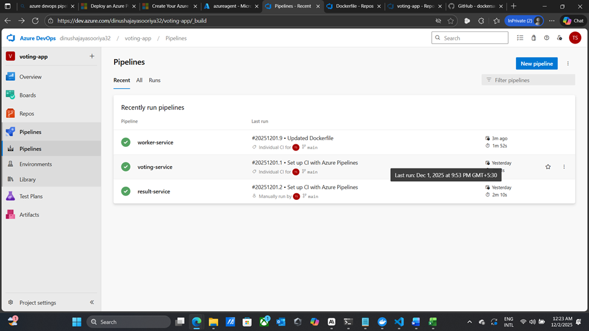
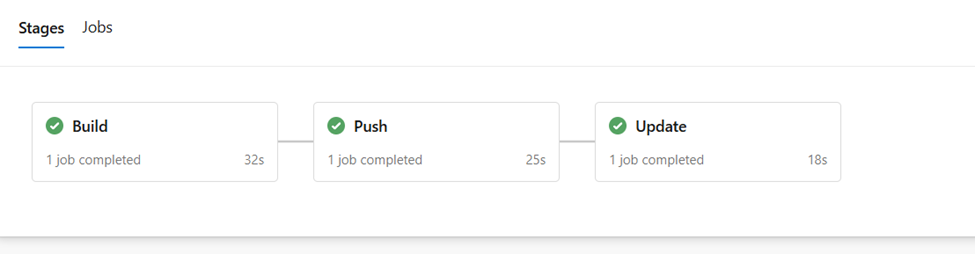
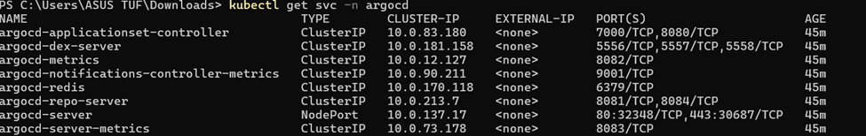
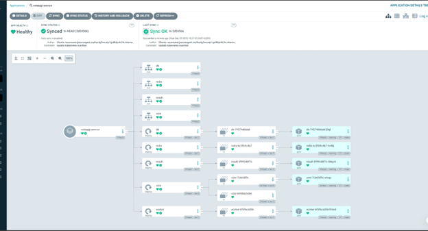
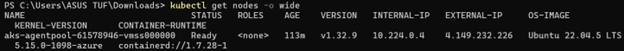
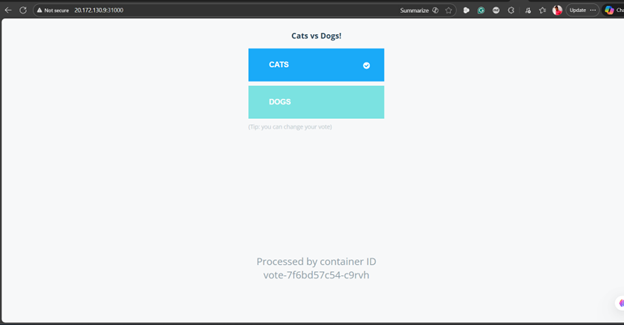
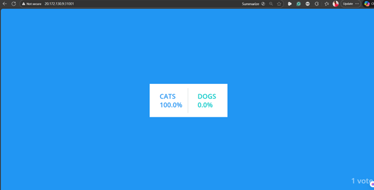

# Example Voting App

A simple distributed application running across multiple Docker containers.

## Getting started

Download [Docker Desktop](https://www.docker.com/products/docker-desktop) for Mac or Windows. [Docker Compose](https://docs.docker.com/compose) will be automatically installed. On Linux, make sure you have the latest version of [Compose](https://docs.docker.com/compose/install/).

This solution uses Python, Node.js, .NET, with Redis for messaging and Postgres for storage.

Run in this directory to build and run the app:

```shell
docker compose up
```

The `vote` app will be running at [http://localhost:8080](http://localhost:8080), and the `results` will be at [http://localhost:8081](http://localhost:8081).

Alternately, if you want to run it on a [Docker Swarm](https://docs.docker.com/engine/swarm/), first make sure you have a swarm. If you don't, run:

```shell
docker swarm init
```

Once you have your swarm, in this directory run:

```shell
docker stack deploy --compose-file docker-stack.yml vote
```

## Run the app in Kubernetes

The folder k8s-specifications contains the YAML specifications of the Voting App's services.

Run the following command to create the deployments and services. Note it will create these resources in your current namespace (`default` if you haven't changed it.)

```shell
kubectl create -f k8s-specifications/
```

The `vote` web app is then available on port 31000 on each host of the cluster, the `result` web app is available on port 31001.

To remove them, run:

```shell
kubectl delete -f k8s-specifications/
```

## Architecture


* A front-end web app in [Python](/vote) which lets you vote between two options
* A [Redis](https://hub.docker.com/_/redis/) which collects new votes
* A [.NET](/worker/) worker which consumes votes and stores them in…
* A [Postgres](https://hub.docker.com/_/postgres/) database backed by a Docker volume
* A [Node.js](/result) web app which shows the results of the voting in real time

## Notes

The voting application only accepts one vote per client browser. It does not register additional votes if a vote has already been submitted from a client.

This isn't an example of a properly architected perfectly designed distributed app... it's just a simple
example of the various types of pieces and languages you might see (queues, persistent data, etc), and how to
deal with them in Docker at a basic level.

# GitOps-Driven Deployment Pipeline for Microservices

**A comprehensive implementation of continuous integration and deployment using Azure cloud services, automated container orchestration, and GitOps principles.**

---

## Project Summary

This repository contains a fully automated deployment pipeline for a multi-service voting application. The implementation leverages Azure's cloud infrastructure combined with GitOps methodology to achieve automated, declarative deployments. When developers push code changes, the pipeline automatically builds container images, updates deployment configurations, and synchronizes the live environment—all without manual intervention.

**Base Application**: Docker Example Voting App

---

## Technology Components

**Cloud Infrastructure**
- Microsoft Azure (Cloud Provider)
- Azure Kubernetes Service - Container orchestration platform
- Azure Container Registry - Private image repository

**Automation & Deployment**
- Azure DevOps Pipelines - CI/CD automation
- ArgoCD - GitOps continuous delivery
- Docker - Application containerization

**Application Services**
- Redis - In-memory data store
- PostgreSQL - Relational database

---

## Getting Started

### Prerequisites

Before beginning, ensure you have:
- An active Azure subscription
- Azure CLI installed and configured
- kubectl command-line tool
- Access to Azure DevOps
- Git installed locally

### Azure Cloud Resources

#### Step 1: Resource Group Creation

```bash
az group create --name votingapp-rg --location eastus
```

#### Step 2: Container Registry Setup

```bash
az acr create \
  --resource-group votingapp-rg \
  --name VotingAppRegistry \
  --sku Basic
```

#### Step 3: Kubernetes Cluster Provisioning

```bash
az aks create \
  --resource-group votingapp-rg \
  --name azuredevops \
  --node-count 2 \
  --enable-addons monitoring \
  --generate-ssh-keys
```

#### Step 4: Registry Integration

Connect your container registry to the Kubernetes cluster:

```bash
az aks update \
  --resource-group votingapp-rg \
  --name azuredevops \
  --attach-acr VotingAppRegistry
```

#### Step 5: Local Kubernetes Configuration

```bash
az aks get-credentials \
  --resource-group votingapp-rg \
  --name azuredevops \
  --overwrite-existing
```

Validate connectivity:
```bash
kubectl get nodes
```

#### Step 6: Network Access Configuration

Enable external access by configuring Network Security Group rules:

```bash
# Identify the NSG
NSG_NAME=$(az network nsg list --resource-group MC_votingapp-rg_azuredevops_eastus --query "[0].name" -o tsv)

# Configure port for voting interface (31000)
az network nsg rule create \
  --resource-group MC_votingapp-rg_azuredevops_eastus \
  --nsg-name $NSG_NAME \
  --name AllowVoteNodePort \
  --priority 100 \
  --destination-port-ranges 31000 \
  --access Allow \
  --protocol Tcp

# Configure port for results interface (31001)
az network nsg rule create \
  --resource-group MC_votingapp-rg_azuredevops_eastus \
  --nsg-name $NSG_NAME \
  --name AllowResultNodePort \
  --priority 101 \
  --destination-port-ranges 31001 \
  --access Allow \
  --protocol Tcp
```

---

## CI/CD Pipeline Architecture

### Pipeline Organization

The project uses a multi-pipeline approach where each microservice has its own dedicated pipeline:


| Service Component | Pipeline File | Trigger Condition |
|------------------|---------------|-------------------|
| Voting Interface | azure-pipelines-vote.yml | Changes in `vote/**` |
| Results Display | azure-pipelines-result.yml | Changes in `result/**` |
| Background Processor | azure-pipelines-worker.yml | Changes in `worker/**` |

### Pipeline Workflow

Each pipeline executes three distinct stages:

```yaml
stages:
  - stage: Build          # Container image creation
  - stage: Push           # Image publication to ACR
  - stage: Update # Kubernetes configuration update
```


### Azure DevOps Setup

#### Creating Your Project

1. Navigate to your Azure DevOps organization
2. Create a new project workspace
3. Import this repository into the project

#### Agent Configuration

This project requires a self-hosted build agent. Set up an Azure VM:

```bash
# SSH into your VM and run:
mkdir myagent && cd myagent
wget https://vstsagentpackage.azureedge.net/agent/3.x.x/vsts-agent-linux-x64-3.x.x.tar.gz
tar zxvf vsts-agent-linux-x64-3.x.x.tar.gz
./config.sh
./run.sh
```

The agent pool name used is `MyAzureAgentPool`.

#### Service Connection Setup

1. Open Project Settings in Azure DevOps
2. Navigate to Service Connections
3. Create a new Docker Registry connection pointing to your ACR
4. Note the connection identifier for pipeline configuration

### Automated Manifest Updates

The `scripts/update-manifest.sh` script maintains GitOps principles by automatically updating deployment manifests:

```bash
# Updates image references in Kubernetes manifests
sed -i "s|image: .*|image: ${ACR_REGISTRY}/${SERVICE_NAME}service:${IMAGE_TAG}|g" "$MANIFEST_FILE"
git commit -m "Update ${SERVICE_NAME} image tag to ${IMAGE_TAG} [skip ci]"
git push origin HEAD:main
```

---

## ArgoCD Configuration

### Installation Process

#### Create Dedicated Namespace

```bash
kubectl create namespace argocd
```

#### Deploy ArgoCD Components

```bash
kubectl apply -n argocd \
  -f https://raw.githubusercontent.com/argoproj/argo-cd/stable/manifests/install.yaml
```

#### Verify Deployment

```bash
# Monitor pod status
kubectl get pods -n argocd -w

# View all ArgoCD resources
kubectl get all -n argocd
```

### Accessing ArgoCD

#### Expose the Dashboard

Modify the ArgoCD server service type:

```bash
kubectl patch svc argocd-server -n argocd -p '{"spec": {"type": "NodePort"}}'
```

Alternative manual approach:
```bash
kubectl edit svc argocd-server -n argocd
# Change: type: ClusterIP
# To:     type: NodePort
```

#### Retrieve Access Details

Get the external endpoint:
```bash
kubectl get svc argocd-server -n argocd
```

Expected response format:
```
NAME            TYPE           CLUSTER-IP     EXTERNAL-IP      PORT(S)
argocd-server   NodePort   10.0.x.x       20.xxx.xxx.xxx   80:xxxxx/TCP,443:xxxxx/TCP
```



Retrieve admin credentials:
```bash
kubectl get secret argocd-initial-admin-secret -n argocd \
  -o jsonpath="{.data.password}" | base64 -d && echo
```

#### Dashboard Login

1. Open `https://<EXTERNAL-IP>` in your browser
2. Accept the security certificate prompt
3. Enter credentials:
   - **Username**: admin
   - **Password**: (from previous command)

### Application Configuration

#### Using the Web Interface

1. Click "+ NEW APP" in the ArgoCD UI
2. Enter application details:
   - **Application Name**: voting-app
   - **Project**: default
   - **Sync Policy**: Automatic
   - **Repository URL**: https://github.com/Dinusha-ChathurangaCSE/Voting-App-Azure-DevOps
   - **Path**: k8s-specifications
   - **Cluster URL**: https://kubernetes.default.svc
   - **Namespace**: dev
3. Click CREATE

#### Using Command Line

```bash
argocd app create voting-app \
  --repo https://github.com/Chamikajaya/Azure-DevOps-GitOps-CI-CD-Project \
  --path k8s-specifications \
  --dest-server https://kubernetes.default.svc \
  --dest-namespace dev \
  --sync-policy automated
```

---

## Application Deployment

### Namespace Preparation

```bash
kubectl create namespace dev
```

### Deployment Verification

Monitor deployment progress:

```bash
# View all resources
kubectl get all -n dev

# Check deployment state
kubectl get deployments -n dev

# Monitor pod health
kubectl get pods -n dev
```

### ArgoCD Synchronization

Access the ArgoCD dashboard and confirm all components display "Synced" and "Healthy" status indicators.

---

## Application Access

### Obtain Node IP

```bash
kubectl get nodes -o wide
```

### Service Endpoints

| Application Component | Access URL | Port Number |
|----------------------|------------|-------------|
| Voting Interface | http://<NODE-IP>:31000 | 31000 |
| Results Dashboard | http://<NODE-IP>:31001 | 31001 |

---

## Key Implementation Highlights

**Automation First**: Complete deployment automation from code commit to production

**Declarative Configuration**: Git repository as the authoritative source for system state

**Automatic Recovery**: ArgoCD continuously ensures actual state matches desired state

**Selective Builds**: Intelligent triggering ensures only modified services are rebuilt

**Zero-Touch Deployment**: No manual steps required for production releases

---

## Pipeline Flow Diagram

```
Code Push → Azure DevOps → Build Image → Push to ACR → Update Manifest → Git Commit → ArgoCD Sync → AKS Deployment
```

This automated workflow ensures rapid, reliable deployments while maintaining complete traceability and rollback capabilities.


## Final Application UI after deployement


